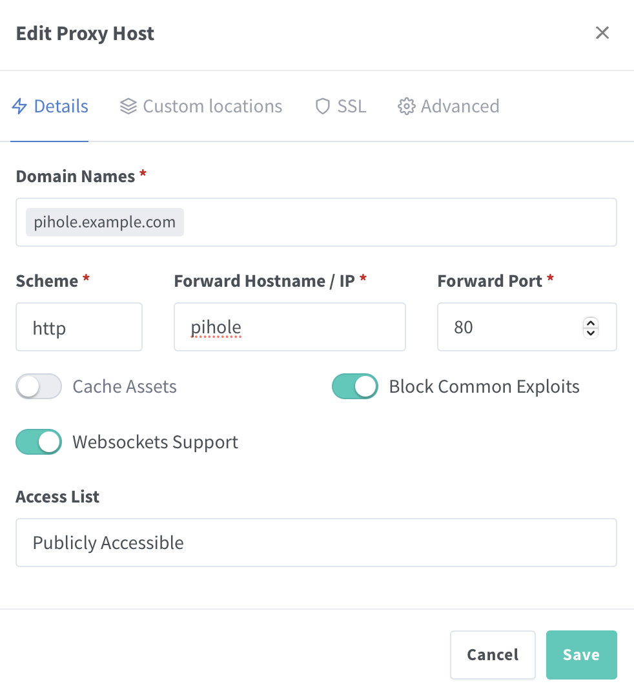
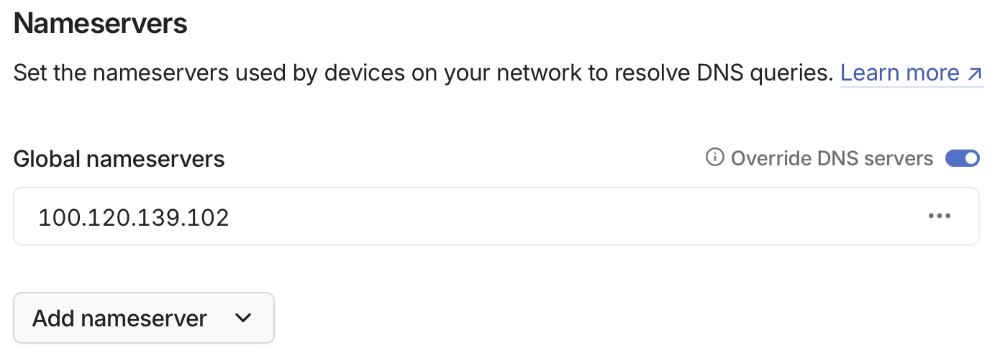

# 📦 Pi-hole Docker Compose Stack

[](LICENSE)
[](https://www.docker.com/)
[](https://openzfs.org/)

[](https://pi-hole.net/)

This repository contains a minimal and production-ready [Pi-hole](https://pi-hole.net/) stack using Docker Compose. Pi-hole is a network-wide ad blocker that acts as a DNS sinkhole and optionally a DHCP server.

---

## 📁 Directory Structure

```bash
tank/
├── docker/
│   ├── compose/
│   │   └── Pihole/              # Git repo lives here
│   │       ├── docker-compose.yml  # Main Docker Compose config
│   │       ├── .env                # Runtime environment variables and secrets (gitignored!)
│   │       ├── env.example         # Example .env file for reference
│   │       └── README.md           # This file
│   └── data/
│       └── Pihole/              # Volume mounts and persistent data
```

---

## 🧰 Prerequisites

* Docker Engine
* Docker Compose V2
* Git
* (Optional) ZFS on Linux for dataset management

> ⚠️ **Note:** These instructions assume your ZFS pool is named `tank`. If your pool has a different name (e.g., `rpool`, `zdata`, etc.), replace `tank` in all paths and commands with your actual pool name.

---

## ⚙️ Setup Instructions

1. **Create the stack directory and clone the repository**

   If using ZFS:
   ```bash
   sudo zfs create -p tank/docker/compose/Pihole
   cd /tank/docker/compose/Pihole
   sudo git clone https://github.com/Vantasin/Pihole.git .
   ```

   If using standard directories:
   ```bash
   mkdir -p ~/docker/compose/Pihole
   cd ~/docker/compose/Pihole
   git clone https://github.com/Vantasin/Pihole.git .
   ```

2. **Create the runtime data directory** (optional)

   If using ZFS:
   ```bash
   sudo zfs create -p tank/docker/data/Pihole
   ```

   If using standard directories:
   ```bash
   mkdir -p ~/docker/data/Pihole
   ```

3. **Configure environment variables**

   Copy and modify the `.env` file:

   ```bash
   sudo cp env.example .env
   sudo nano .env
   sudo chmod 600 .env
   ```

    > **Tip:** You must use [Nginx Proxy Manager](https://github.com/Vantasin/Nginx-Proxy-Manager.git) as a reverse proxy to access `Pihole`.
    >
    > **Proxy Host:**
    >  - **Domain Name:** `https://pihole.example.com`
    >  - **Scheme:** `http`
    >  - **Forward Hostname/IP:** `pihole`
    >  - **Forward Port:** `80`

4. **Start Pihole**

   ```bash
   docker compose up -d
   ```

---

## 🌐 Accessing Pi-hole Web UI

Once deployed, access Pi-hole using:

- **Web Interface (HTTP):** `https://pihole.example.com`.  
- **Admin Password:** Must be set via `WEBPASSWORD` in `.env` or a random password will be generated.

> **Note:** You must use [Nginx Proxy Manager](https://github.com/Vantasin/Nginx-Proxy-Manager.git) as a reverse proxy for HTTPS certificates via Let's Encrypt.

<p align="center">
  
</p>

> **Note:** Consider using [Tailscale](https://tailscale.com/) then setting `Global nameservers` to your host server's (the server running Pi-hole) Tailscale IP address and enabling `Override DNS servers`. This will make Pi-hole the sole DNS resolver for all devices on your Tailscale network and will allow Pi-hole to filter domains thereby blocking Ads.

<p align="center">
  
</p>

---

## 🙏 Acknowledgments

- [ChatGPT](https://openai.com/chatgpt) — for assistance in generating setup scripts and templates.
- [Docker](https://www.docker.com/) — for container orchestration and runtime.
- [OpenZFS](https://openzfs.org/) — for advanced local filesystem features, dataset organization, and snapshotting.
- [Pi-hole](https://pi-hole.net/) — A network-wide ad blocker and DNS sinkhole for privacy and performance.